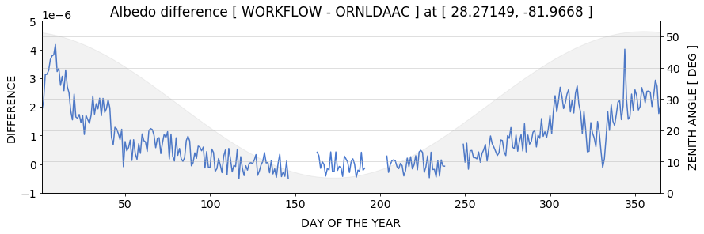
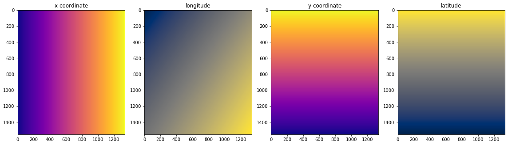
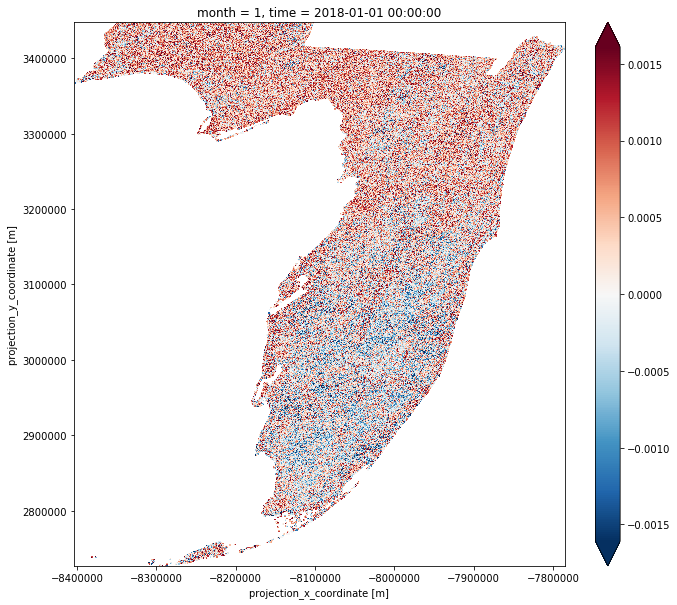

<!--
*** Daily albedos from MODIS BRDF Parameters (MCD43A1)
-->

<!-- PROJECT SHIELDS -->
<!--
*** I'm using markdown "reference style" links for readability.
*** Reference links are enclosed in brackets [ ] instead of parentheses ( ).
*** See the bottom of this document for the declaration of the reference variables
*** for build-url, contributors-url, etc. This is an optional, concise syntax you may use.
*** https://www.markdownguide.org/basic-syntax/#reference-style-links
-->
[![Contributors][contributors-shield]][contributors-url]
[![MIT License][license-shield]][license-url]
[![LinkedIn][linkedin-shield]][linkedin-url]

<!-- PROJECT LOGO -->
 

  

  <!-- HEADER -->
  <h3 align="center">Daily Albedo from MODIS BRDF/Albedo Parameters</h3>
  
  <!-- DESCRIPTION -->
  

    A comprehensive workflow for calculating black, white, and blue sky albedos from the MODIS BRDF model parameters product (MCD43A1) using custom solar zenith angles and optical depth inputs.
  

  
  <!-- LINKS -->
  

    <a href="https://github.com/jjmcnelis/mcd43a1-albedo-python"><strong>Explore the docs »</strong></a>
    · 
    <a href="https://github.com/jjmcnelis/mcd43a1-albedo-python/0_Introduction.ipynb">Interactive Tutorial</a>
    ·
    <a href="https://github.com/jjmcnelis/mcd43a1-albedo-python/issues">Report a Bug</a>
  

  <!-- BROWSE1 -->
  <figure class="image">
    
    <figcaption style="display: block; margin-left: auto; margin-right: auto; width: 75%; text-align:center"><i>Figure 1. Time series blue, black, and white albedo for 2018 for one pixel in central Florida.</i></figcaption>
  </figure>

<!-- TABLE OF CONTENTS -->
## Table of Contents

- [Table of Contents](#Table-of-Contents)
- [Overview](#Overview)
- [Inputs](#Inputs)
- [Outputs](#Outputs)
- [License](#License)
- [Contact](#Contact)

<!-- BROWSE2 -->
<figure class="image">
  
  <figcaption style="display: block; margin-left: auto; margin-right: auto; width: 75%; text-align:center"><i>Figure 2. Time series difference between black sky albedo computed by the ORNL DAAC MODIS Global Tool and this workflow as a way to validate my implementation of the albedo algorithm. Solar zenith angles are shown by the shaded region.</i></figcaption>
</figure>

<!-- ABOUT THE PROJECT -->
## Overview

While some users are content to use the MODIS black sky albedo at local solar noon and the white sky albedo measures as provided in [MCD43A3](https://lpdaac.usgs.gov/dataset_discovery/modis/modis_products_table/mcd43a3_v006), most researchers want to make use of the BRDF/albedo model parameters to get  black sky albedo at different illumination angles or to combine the black sky and white sky albedo as a function of optical depth to get the blue sky albedo. This series of notebooks covers that process.

<table>
    <tr>
        <td style="text-align:left"><a href="0_Introduction.ipynb">0_Introduction.ipynb</a>
</td>
        <td style="text-align:left">Interactive tutorial covers core concepts. Launch in MyBinder: </td>
    </tr>
    <tr>
        <td style="text-align:left"><a href="1_Workflow.ipynb">1_Workflow.ipynb</a></td>
        <td style="text-align:left">Process albedo model parameters to black, white, blue albedos.</td>
    </tr>
    <tr>
        <td style="text-align:left"><a href="2_Batch.ipynb">2_Batch.ipynb</a></td>
        <td style="text-align:left">Bundle workflow into a few functions and loop.</td>
    </tr>
    <tr>
        <td style="text-align:left"><a href="3_Validate.ipynb">3_Validate.ipynb</a></td>
        <td style="text-align:left">Check results against MCD43A3 albedos.</td>
    </tr>
    <tr>
        <td style="text-align:left"><a href="4_Results.ipynb">4_Results.ipynb</a></td>
        <td style="text-align:left">Calculate stats and plot. Also write outputs for Florida USGS evapotranspiration model. <b>(WIP)</b></td>
    </tr>
    <tr>
        <td style="text-align:left"><a href="5_HDFs.ipynb">5_HDFs.ipynb</a></td>
        <td style="text-align:left">AppEEARS alternative, processing HDFs. <b>(WIP)</b></td>
    </tr>
</table>
I've barely started a couple of these (`WIP`). Stay tuned.

If you take a step back, there are quite a few steps required to go end to end with the processing all the way to blue sky albedo. Every step is documented such that an absolute beginner should be able to understand with a little bit of homework. For example, we look at the relationships between coordinate systems and the geographic coordinate space in the second notebook ([1_Workflow.ipynb](1_Workflow.ipynb#)):

<!-- BROWSE3 -->
<figure class="image">
  
  <figcaption style="display: block; margin-left: auto; margin-right: auto; width: 75%; text-align:center"><i>Figure 3. Gridded coordinate values in MODIS sinusoidal projection (1 and 3) and geographic latitude and longitude (2 and 4).</i></figcaption>
</figure>

## Inputs  

You have two options:
1. Input MCD43A1 time series in netCDF format via [AppEEARS](https://lpdaac.usgs.gov/tools/data_access/appeears). Or, if you don't have convenient Python environment 
2. you can batch download the HDFs from LP DAAC data pool by following the steps in [5_HDFs.ipynb](5_HDFs.ipynb).       

Go to the [first notebook (1_Workflow.ipynb)](1_Workflow.ipynb) for more details about data access.

## Outputs
The figure and text below explain a little bit about how I validated the workflow against MCD43A1 albedos computed by the ORNL DAAC's MODIS Global Tool (Figure 2) and the standard black and white sky albedos from the MCD43A3 product (Figure 3).

The difference between our time series and the one computed by the ORNL DAAC (*see Figure 2 above*) is negligible, purely rounding error; and, if you check the plot above, it's obviously related to the zenith angle. The concave shape of the curve resembles the zenith angle change through the year. The disparity (see y-axis precision in scientific notation at the top of y1-axis) comes from the ORNL DAAC's zenith angle calculator. It returns five decimal places. I didn't do any rounding so we're using the max precision allowed by `numpy`, some huge number of decimal places.

<!-- BROWSE4 -->

<figure class="image">
  
  <figcaption style="display: block; margin-left: auto; margin-right: auto; width: 75%; text-align:center"><i>Figure 4. Difference of black sky albedo rasters (2) for January 1, 2018: a. released in MCD43A3 standard product, and, b. computed in this workflow.</i></figcaption>
</figure>

Figure 3 depicts the differenced black sky albedo rasters for January 1, 2018 computed by **(1)** the SIPS for the standard black and white sky albedo product (MCD43A3) and **(2)** this workflow.

<!-- LICENSE -->
## License

Distributed under the MIT License. See `LICENSE` for more information.

<!-- CONTACT -->
## Contact

Jack McNelis - jjmcnelis@outlook.com

<!-- MARKDOWN LINKS & IMAGES -->
<!-- https://www.markdownguide.org/basic-syntax/#reference-style-links -->

[contributors-shield]: https://img.shields.io/badge/contributors-1-orange.svg?style=flat-square
[contributors-url]: https://github.com/jjmcnelis/mcd43a1-albedo-python/graphs/contributors

[license-shield]: https://img.shields.io/badge/license-MIT-blue.svg?style=flat-square
[license-url]: https://choosealicense.com/licenses/mit/

[linkedin-shield]: https://img.shields.io/badge/-LinkedIn-black.svg?style=flat-square&logo=linkedin&colorB=555
[linkedin-url]: https://linkedin.com/in/jjmcnelis
