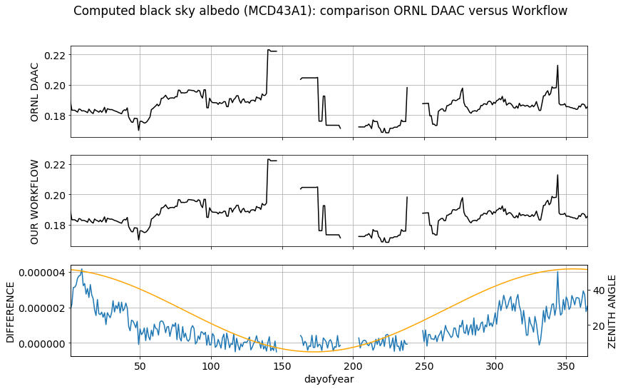

<!--
*** Daily albedos from MODIS BRDF Parameters (MCD43A1)
-->

<!-- PROJECT SHIELDS -->
<!--
*** I'm using markdown "reference style" links for readability.
*** Reference links are enclosed in brackets [ ] instead of parentheses ( ).
*** See the bottom of this document for the declaration of the reference variables
*** for build-url, contributors-url, etc. This is an optional, concise syntax you may use.
*** https://www.markdownguide.org/basic-syntax/#reference-style-links
-->
[![Contributors][contributors-shield]][contributors-url]
[![MIT License][license-shield]][license-url]
[![LinkedIn][linkedin-shield]][linkedin-url]

<!-- PROJECT LOGO -->
 

  

  <h3 align="center">Daily Albedo from MODIS BRDF/Albedo Parameters</h3>

  

    A comprehensive workflow for calculating black-, white-, and blue-sky albedos from the MODIS BRDF model parameters product (MCD43A1) using custom solar zenith angles and optical depth inputs.
      
    <a href="https://github.com/jjmcnelis/mcd43a1-albedo-python"><strong>Explore the docs »</strong></a>
    · 
    <a href="https://github.com/jjmcnelis/mcd43a1-albedo-python/0_Introduction.ipynb">Interactive Tutorial</a>
    ·
    <a href="https://github.com/jjmcnelis/mcd43a1-albedo-python/issues">Report a Bug</a>
  

<!-- TABLE OF CONTENTS -->
## Table of Contents

- [Table of Contents](#Table-of-Contents)
- [Overview](#Overview)
- [Inputs](#Inputs)
- [Outputs](#Outputs)
- [License](#License)
- [Contact](#Contact)

<!-- ABOUT THE PROJECT -->
## Overview

While some users are content to use the MODIS black sky albedo at local solar noon and the white sky albedo measures as provided in [MCD43A3](https://lpdaac.usgs.gov/dataset_discovery/modis/modis_products_table/mcd43a3_v006), most researchers want to make use of the BRDF/albedo model parameters to get  black sky albedo at different illumination angles or to combine the black sky and white sky albedo as a function of optical depth to get the blue sky albedo. This series of notebooks covers that process.

<table>
    <tr>
        <td style="text-align:left"><a href="0_Introduction.ipynb">0_Introduction.ipynb</a>
</td>
        <td style="text-align:left">Interactive tutorial covers core concepts. Launch in MyBinder: </td>
    </tr>
    <tr>
        <td style="text-align:left"><a href="1_Workflow.ipynb">1_Workflow.ipynb</a></td>
        <td style="text-align:left">Process albedo model parameters to black, white, blue albedos.</td>
    </tr>
    <tr>
        <td style="text-align:left"><a href="2_Batch.ipynb">2_Batch.ipynb</a></td>
        <td style="text-align:left">Bundle workflow into a few functions and loop.</td>
    </tr>
    <tr>
        <td style="text-align:left"><a href="3_Results.ipynb">3_Results.ipynb</a></td>
        <td style="text-align:left">Calculate statistics and plot. Write outputs for Florida USGS evapotranspiration model. <b>(WIP)</b></td>
    </tr>
    <tr>
        <td style="text-align:left"><a href="4_Validate.ipynb">4_Validate.ipynb</a></td>
        <td style="text-align:left">Check results against MCD43A3 albedos.</td>
    <tr>
        <td style="text-align:left"><a href="5_HDFs.ipynb">5_HDFs.ipynb</a></td>
        <td style="text-align:left">AppEEARS alternative, processing HDFs. <b>(WIP)</b></td>
    </tr>
</table>

Some of these I've barely started. `WIP == WORK IN PROGRESS`

## Inputs  

You have two options:
1. Input MCD43A1 time series in netCDF format via [AppEEARS](https://lpdaac.usgs.gov/tools/data_access/appeears). Or, if you don't have convenient Python environment 
2. you can batch download the HDFs from LP DAAC data pool by following the steps in [5_HDFs.ipynb](5_HDFs.ipynb).       

Go to the [first notebook (1_Workflow.ipynb)](1_Workflow.ipynb) for more details about data access.

## Outputs
The result of the black sky albedo calculation for a sample pixel is reviewed briefly below.
<figure class="image">
  
  <figcaption><i>Plots of daily black sky albedo computed by (1) ORNL DAAC backend and (2) by this workflow, as well as (3) the difference of the two and zenith angles plotted by day of the year.</i></figcaption>
</figure>

The plots above depict daily black sky albedo time series (x2) for a single pixel in central Florida as computed:

1. using the first two notebooks in this series ([1_Workflow.ipynb](1_Workflow.ipynb), [2_Batch.ipynb](2_Batch.ipynb)), and,       
2. by the [MODIS/VIIRS Global Subset Tool](https://modis.ornl.gov/cgi-bin/MODIS/global/subset.pl) hosted by [ORNL DAAC](https://daac.ornl.gov/).        

The third plot depicts the *differenced* black sky albedo in **blue** and the *solar zenith angle* in **orange**.

Our time series is identical to the ORNL DAAC's excluding micro rounding error. The difference should be related to the zenith angle. The concave time series resembles the zenith angle curve in the northern hemisphere. The disparity (see y-axis precision) comes from the ORNL DAAC's zenith angle calculator. It returns five decimal places. I didn't do any rounding so we're using the max precision allowed by `numpy`.

<!-- LICENSE -->
## License

Distributed under the MIT License. See `LICENSE` for more information.

<!-- CONTACT -->
## Contact

Jack McNelis - jjmcnelis@outlook.com

<!-- MARKDOWN LINKS & IMAGES -->
<!-- https://www.markdownguide.org/basic-syntax/#reference-style-links -->

[contributors-shield]: https://img.shields.io/badge/contributors-1-orange.svg?style=flat-square
[contributors-url]: https://github.com/jjmcnelis/mcd43a1-albedo-python/graphs/contributors

[license-shield]: https://img.shields.io/badge/license-MIT-blue.svg?style=flat-square
[license-url]: https://choosealicense.com/licenses/mit/

[linkedin-shield]: https://img.shields.io/badge/-LinkedIn-black.svg?style=flat-square&logo=linkedin&colorB=555
[linkedin-url]: https://linkedin.com/in/jjmcnelis
