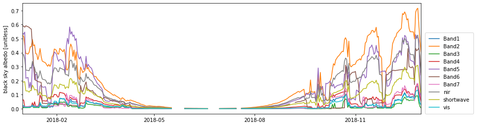

# Daily albedos from MODIS BRDF Parameters (MCD43A1)
*Florida USGS report - evapotranspiration modeling*

*black sky albedo time series 2018 for sample pixel in 0_Introduction.ipynb*

## Data and C source code
* Data: [Go](data/)         
* Docs: [Go](proc/)           

## Notebooks
<table>
    <tr>
        <td style="text-align:left"><a href="0_Introduction.ipynb">0_Introduction.ipynb</a></td>
        <td style="text-align:left">Fundamental concepts explained.</b></td>
        <td style="text-align:center"></td>
    </tr>
    <tr>
        <td style="text-align:left"><a href="1_Workflow_Demo.ipynb">1_Workflow_Demo.ipynb</a></td>
        <td style="text-align:left">Step by step albedo model parameters to black, white, blue albedos</td>
        <td style="text-align:center"></td>
    </tr>
    <tr>
        <td style="text-align:left"><a href="2_Batch_Process.ipynb">2_Batch_Process.ipynb</a></td>
        <td style="text-align:left">Bundle entire workflow into a few functions and loop</td>
        <td style="text-align:center"></td>
    </tr>
    <tr>
        <td style="text-align:left"><a href="3_Plot_Results.ipynb">3_Plot_Results.ipynb</a></td>
        <td style="text-align:left">Calculate statistics and plot</td>
        <td style="text-align:center"></td>
    </tr>
    <tr>
        <td style="text-align:left"><a href="4_Validate.ipynb">4_Validate.ipynb</a></td>
        <td style="text-align:left">Check results against blue albedos computed from MCD43A3</td>
        <td style="text-align:center"></td>
    <tr>
        <td style="text-align:left"><a href="5_Alternative_Workflow_HDFs.ipynb">5_Alternative_Workflow_HDFs.ipynb</a></td>
        <td style="text-align:left">Examples to get you started processing HDFs instead of AppEEARS subset</td>
        <td style="text-align:center"></td>
    </tr>
</table>